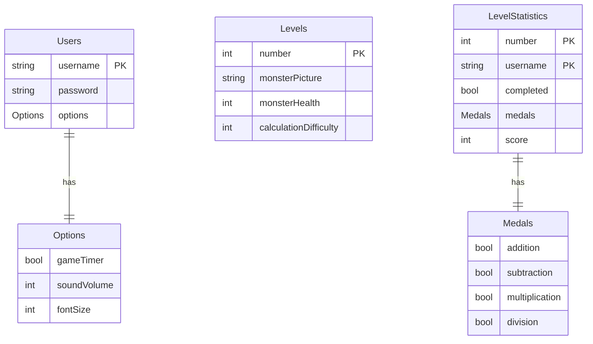

# Backend / Server

## Database

3 Collections:

Users, Levels and LevelStatistics

```mermaid
erDiagram
    Users {
        string username PK
        string password
        Options options
    }
    Users ||--|| Options : has
    Options {
        bool gameTimer
        int soundVolume
        int fontSize
    }

    Levels {
        int number PK
        string monsterPicture
        int monsterHealth
        int calculationDifficulty
    }

    LevelStatistics {
        int number PK
        string username PK
        bool completed
        Medals medals
        int score
    }
    LevelStatistics ||--|| Medals : has
    Medals {
        bool addition
        bool subtraction
        bool multiplication
        bool division
    }

```
